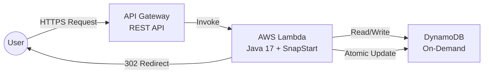

# Serverless Global URL Shortener


A **high-performance, fully serverless** URL shortening service built with **Spring Boot 3**, **AWS Lambda**, and **Amazon DynamoDB**.  
Designed for **sub-500ms cold starts**, **zero-cost when idle**, and **perfect analytics accuracy** under extreme concurrency (e.g., viral "celebrity tweet" scenarios).

Live Demo: [Link](https://2nzlphq3qb.execute-api.ap-south-2.amazonaws.com/dev/health)


Try shortening: `POST` to `/api/v1/shorten`

---

## Overview

This is a cloud-native, event-driven URL shortener that scales instantly from 0 to thousands of RPS with **zero servers to manage**.

Key differentiators from typical tutorials:
- Solves Java cold starts using **AWS Lambda SnapStart** (CRaC)
- Race-condition-free click analytics using **DynamoDB atomic counters**
- Collision-safe custom aliases via **optimistic locking**
- Production-ready architecture using the **Adapter Pattern**

---

Base Url(API Gateway): https://2nzlphq3qb.execute-api.ap-south-2.amazonaws.com/dev


### 1. Shorten a URL
```
POST {{baseUrl}}/api/v1/shorten
Content-Type: application/json

{
  "originalUrl": "https://google.com",
}
```

### 2. Get Url(Redirect Url)
```
GET {{baseUrl}}/{shortCode}
```

### 3. Stats Endpoint
```
GET {{baseUrl}}/{shortCode}/stats
```

## Architecture



