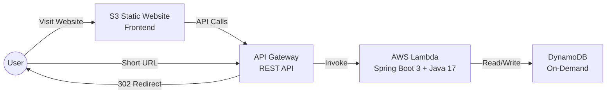

# Serverless Global URL Shortener


A **high-performance, fully serverless** URL shortening service built with **Spring Boot 3**, **AWS Lambda**, and **Amazon DynamoDB**.  
Designed for **sub-500ms cold starts**, **zero-cost when idle**, and **perfect analytics accuracy** under extreme concurrency (e.g., viral "celebrity tweet" scenarios).

🌐 **Live Demo**: [url-shortener-manikanta-adupa.s3-website.ap-south-2.amazonaws.com](http://url-shortener-manikanta-adupa.s3-website.ap-south-2.amazonaws.com)

---

## Tech Stack

| Layer | Technology | Description |
|-------|------------|-------------|
| **Frontend** | AWS S3 Static Website | Simple HTML/CSS/JS hosted on S3 with static website hosting enabled |
| **API Gateway** | AWS API Gateway (REST) | Handles HTTPS requests, routes to Lambda, manages CORS |
| **Backend** | AWS Lambda + Spring Boot 3 | Serverless Java 17 runtime with SnapStart for fast cold starts |
| **Database** | Amazon DynamoDB | NoSQL database with on-demand capacity, TTL for link expiration |

---

## Overview

This is a cloud-native, event-driven URL shortener that scales instantly from 0 to thousands of RPS with **zero servers to manage**.

### Key Features
- ⚡ **Serverless Architecture** - No servers to provision or manage
- 🚀 **Fast Cold Starts** - AWS Lambda SnapStart (CRaC) for sub-500ms startup
- 📊 **Accurate Analytics** - DynamoDB atomic counters for race-condition-free click tracking
- 🔒 **Collision-Safe** - Optimistic locking prevents duplicate short codes
- 💰 **Cost Efficient** - Pay only for what you use, zero cost when idle
- 🌍 **Globally Accessible** - S3 static hosting + API Gateway for worldwide availability

---

## Deployment

| Component | Hosted On |
|-----------|-----------|
| **Frontend** | AWS S3 (Static Website Hosting) |
| **Backend API** | AWS Lambda via API Gateway |
| **Database** | Amazon DynamoDB |

**API Base URL**: `https://2nzlphq3qb.execute-api.ap-south-2.amazonaws.com/dev`

---

## API Endpoints

### 1. Shorten a URL
```
POST {{baseUrl}}/api/v1/shorten
Content-Type: application/json

{
  "originalUrl": "https://google.com",
}
```

### 2. Get Url(Redirect Url)
```
GET {{baseUrl}}/{shortCode}
```

### 3. Stats Endpoint
```
GET {{baseUrl}}/{shortCode}/stats
```

## Architecture



### Request Flow

1. **User visits frontend** → S3 serves the static HTML/JS
2. **User submits long URL** → Frontend calls `POST /api/v1/shorten`
3. **API Gateway** → Routes request to Lambda function
4. **Lambda (Spring Boot)** → Generates short code, saves to DynamoDB
5. **Response** → Returns short code to frontend
6. **User clicks short link** → API Gateway triggers Lambda → Fetches original URL → Returns 302 redirect

---

## Local Development

### Prerequisites
- Java 17+
- Maven 3.8+
- AWS CLI configured with credentials

### Build
```bash
./mvnw clean package -DskipTests
```

### Deploy to Lambda
Upload the generated JAR to your Lambda function:
```
target/url-shortener-0.0.1-SNAPSHOT.jar
```

